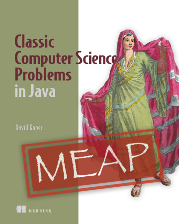

# Classic Computer Science Problems in Java
This repository contains source code to accompany the book *Classic Computer Science Problems in Java* by David Kopec, [now available in early access form from Manning](https://www.manning.com/books/classic-computer-science-problems-in-java?a_aid=oaksnow&a_bid=6430148a). You will find the source organized by chapter. **As you read the book, each code listing contains a file name that corresponds to a file in this repository.** The book is due for publication in late 2020.

## Conventions
The source code was written against version 11 of the Java language and should run on any known newer version at the time of publication. It makes use of no Java libraries beyond the standard library. It was developed in Eclipse and this folder can be opened as an Eclipse workspace. You can then right-click any file with a `main()` method and select "Run" to compile and execute it. All other popular Java IDEs can import Eclipse projects, but you can also easily create a project out of each chapter, which is bundled as a Java package. For directions importing Eclipse projects into IntelliJ see [this tutorial from Jetbrains.](https://www.jetbrains.com/help/idea/import-project-from-eclipse-page-1.html)

## Questions about the Book
You can find general questions and descriptive information about the book on the [Classic Computer Science Problems](https://classicproblems.com/) website. Also, feel free to reach out to me on Twitter, [@davekopec](https://twitter.com/davekopec). If you think you found an error in the source code, please open an issue up here on GitHub.

## License
All of the source code in this repository is released under the Apache License version 2.0. See `LICENSE`.

## Other Books and Languages

Official Books from the Series by @davecom 
- [Classic Computer Science Problems in Python](https://github.com/davecom/ClassicComputerScienceProblemsInPython)
- [Classic Computer Science Problems in Swift](https://github.com/davecom/ClassicComputerScienceProblemsInSwift)

Ports
- [C++ implementation by @aray-andres](https://github.com/araya-andres/classic_computer_sci)
- [Go implementation by @arlima](https://github.com/arlima/problemas_classicos_CC)
- [PHP implementation by @SaschaKersken (German translator of CCSPiP)](https://github.com/SaschaKersken/ClassicComputerScienceProblemsInPhp)
- [JavaScript implementation by @SaschaKersken (German translator of CCSPiP)](https://github.com/SaschaKersken/ClassicComputerScienceProblemsInJavaScript)
- [Ruby implementation by @tj84](https://github.com/tj84/cs_problems)
